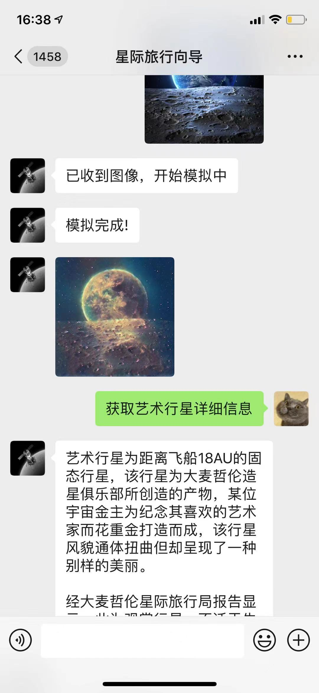
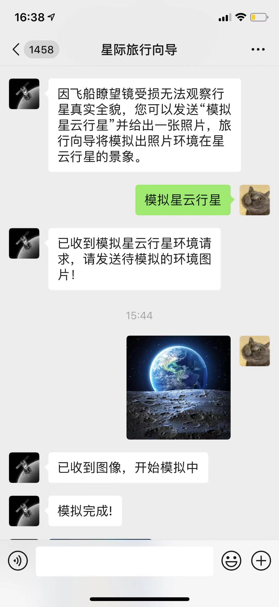
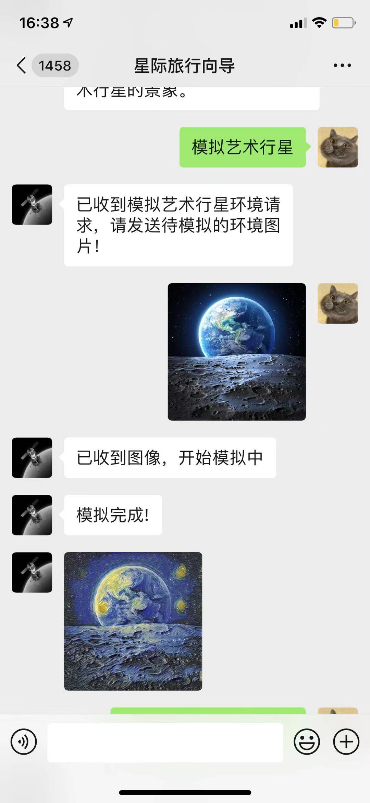
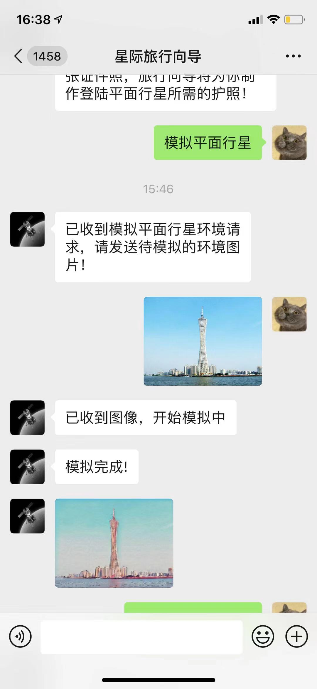

# Cosmic-Wanderer-Guide-Robot
基于PaddlePaddle以及wechaty框架 建立的宇宙漫游指南机器人 

本项目基于什么完成？

1.本项目基于WeChaty

2.本项目基于paddlegan

b站🔗：https://www.bilibili.com/video/BV1Df4y1G7Qh
AIstudio链接：

  

#  未来的某一天，你迷失于星际的航行之中，情急之下，你联系上了星际旅行向导，他会帮助你完成你的星际旅行。

#  微信聊天机器人效果展示

